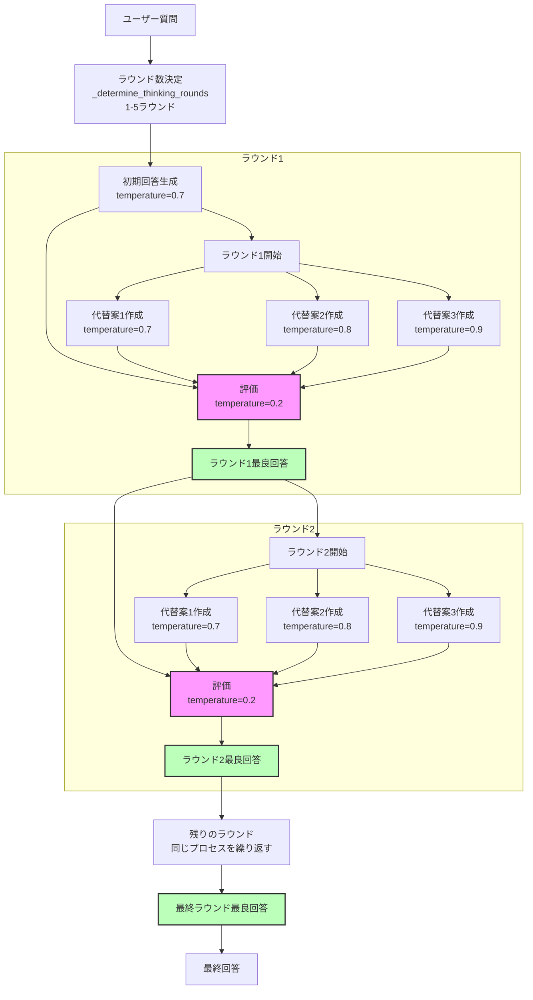

# cort-mcp

Chain-of-Recursive-Thoughts (CORT) MCPサーバー/CLIツール

---

## 特徴
- 再帰的思考AIロジックをパッケージ本体に集約
- CLIバッチ・MCPサーバー両対応
- OpenAI/OpenRouter API両対応
- pipx/uvxインストール・即コマンド利用可能
- 試行回数は3で固定
---

## ディレクトリ構成

```
cort-mcp/
├── cort_mcp/
│   ├── __init__.py
│   ├── recursive_thinking_ai.py
│   └── server.py
├── pyproject.toml
├── README.md
├── CHANGELOG.md
└── tests/
    └── test_server.py
```

---

## インストール

```
pipx install .
# または
uvx install .
```

---

## 使い方

### MCPサーバーモード（標準入出力でMCPプロトコルを受け付け）
```
cort-server
```

### CLIバッチモード（1回だけAI応答を返す）
```
cort-server --cli --prompt "質問内容"
```

### モデル指定・JSON出力例
```
cort-server --cli --prompt "質問" --model "openrouter/mistral-7b" --json
```

---

## ツールインターフェイス定義（MCPツール仕様）

> **⚠️ 注意:**
> オプションパラメータ（`model`や`provider`など）をAI呼び出し時に明示的に`null`や空文字で渡すと、API側でエラーとなる場合があります。
> 
> **未指定の場合はパラメータごと省略してください。**
> 例: Pythonの`None`やJSONの`null`をそのまま渡さず、パラメータ自体を送信しないことを推奨します。
> 
> これにより「AI呼び出し時にオプションパラメータへnullを設定し失敗していた問題」を回避できます。


### cort.think.simple
- **説明:** シンプルな再帰的思考AI応答を返す
- **パラメータ:**
    - `prompt` (string, 必須): AIへの入力プロンプト
    - `model` (string, 任意): 
利用するLLMモデル名を正確に指定してください。
- **推奨値（OpenAIの場合）**: `"gpt-4.1-nano"`
- **推奨値（OpenRouterの場合）**: `"meta-llama/llama-4-maverick:free"`
- **デフォルトモデル**: `gpt-4.1-mini`（OpenAIプロバイダ使用時）
モデル名は各プロバイダの公式リストに従い、正確に入力してください。
指定がない場合はプロバイダごとのデフォルトモデルが利用されます。

    - `provider` (string, 任意): 
利用するAPIプロバイダ名を正確に指定してください。
- 指定可能値: `"openai"` または `"openrouter"`
- **デフォルトプロバイダ**: `openai`
プロバイダによって選択可能なモデルが異なるため、モデル名とプロバイダの組み合わせにご注意ください。
指定がない場合はデフォルトプロバイダが利用されます。
- **戻り値:**
    - `response` (string): AIの応答
    - `model` (string): 使用モデル名
    - `provider` (string): 使用プロバイダー

### cort.think.details
- **説明:** 思考過程の詳細も含めて返す再帰的思考AIツール
- **パラメータ:**
    - `prompt` (string, 必須): AIへの入力プロンプト
    - `model` (string, 任意): モデル名
    - `provider` (string, 任意): "openai" または "openrouter"
- **戻り値:**
    - `response` (string): AIの応答
    - `model` (string): 使用モデル名
    - `provider` (string): 使用プロバイダー
    - `details` (string): 思考履歴や過程のYAML

---

## モデル・APIプロバイダーの切り替え・エラーハンドリング
- モデル名は「リクエストのparams['model']」またはCLIの`--model`で指定
- providerはparams['provider']で明示指定可能（省略時はデフォルト）
- 指定がなければ `server.py` 内の `DEFAULT_MODEL`/`DEFAULT_PROVIDER`（OpenAI/4.1-mini）が使われる
- **指定されたproviderに該当モデルが無い場合や、その他エラー時も自動的にOpenAIの4.1-mini（デフォルト）でフォールバック動作します**
- 外部設定ファイル（settings.json等）は一切不要

---

## APIキー設定
- OpenAI: `OPENAI_API_KEY` 環境変数で指定
- OpenRouter: `OPENROUTER_API_KEY` 環境変数で指定

---

## 進捗・現状レポート（2025-05-08 更新）
### ✅ MCPサーバー起動・MCP Hostからの呼び出し成功
- それほど長くない入力の応答に約1~2分程度かかる
### ✅ logging機能の動作確認
- 引数によるlog=on/offの動作確認
- 引数による指定PATHへlogfile保存確認
### ✅ 思考ラウンドの詳細出力確認
- cort_think_detailsのdetails出力のYAML形式の内容確認
- 各ラウンドのLLMからの出力内容を出力
### ✅ OpenAI/OpenRouter両対応のAPI呼び出し
- デフォルトは「openrouter / mistralai/mistral-small-3.1-24b-instruct:free」です
- OpenAIはAPIキーが無い場合の自動フォールバック先として利用されます
- 動作確認済み

#### 📝 ユーザー追加分TODO
- 代替え候補の生成をオリジナルの 0.1 づつ温度差分を適用する以外を検討
  例えば、別の言い回し、文脈の変更、形容詞による表現の強調など
  オリジナルモードと、代替え候補生成モードを切り替えられるようにする
- README刷新 (内容の精緻化、オリジナルリポジトリに関する言及、英語化)
- コードコメントの英語化
- pipx起動対応
- PyPI公開
---

## コアロジック改変履歴（recursive_thinking_ai.py）

- オリジナル: [PhialsBasement/Chain-of-Recursive-Thoughts](https://github.com/PhialsBasement/Chain-of-Recursive-Thoughts)
- 本プロジェクトでは以下の主な改変を実施：

### 主な改良点

1. **プロバイダ対応の拡張**
   - デフォルトは「openrouter / mistralai/mistral-small-3.1-24b-instruct:free」
   - OpenAIはAPIキーが無い場合の自動フォールバック先
   - OpenRouterのみの対応から、OpenAIとOpenRouter両対応のAPI呼び出しに変更
   - `provider`引数で簡単に切り替え可能

2. **詳細な思考履歴の記録**
   - 各ラウンドでのLLMプロンプト・レスポンス履歴（thinking_history）を詳細に記録
   - details toolのレスポンスとして構造化されたYAML形式で返せるように拡張
   - ラウンドごとの選択プロセスが透明化

3. **エラー処理とログ記録の強化**
   - APIエラー時のフォールバックメカニズムを追加
   - 環境変数によるAPIキー管理を追加
   - 外部ログ機能との連携強化

4. **MCPサーバー向け最適化**
   - サーバー連携用のインターフェースに特化
   - CLIインターフェースや対話型機能を削除し、APIとして利用に特化
   - ストリーミング処理を簡略化し、完了後のレスポンス取得に最適化
   - ファイル保存機能を削除し、レスポンス返却に集中


---

### 起動例
```sh
$ cort-mcp
```

### ログ出力例
```
cort-mcp main() started
Server mode: waiting for MCP stdio requests...
Using selector: EpollSelector
Starting stdio_server session...
stdio_server session established. Running server.run...
```

---

## 開発・保守
- AIロジックは `cort_mcp/recursive_thinking_ai.py` に一元化
- CLI/サーバー切替・ツール登録は `cort_mcp/server.py` で管理
- テストは `tests/` 配下

---

## MCP Host Configuration

When running this MCP Server, you **must explicitly specify the log output mode and (if enabled) the absolute log file path via command-line arguments**.

- `--log=off` : Disable all logging (no logs are written)
- `--log=on --logfile=/absolute/path/to/logfile.log` : Enable logging and write logs to the specified absolute file path
- Both arguments are **required** when logging is enabled. The server will exit with an error if either is missing, the path is not absolute, or if invalid values are given.

### Example: Logging Disabled
```json
"CoRT-chain-of-recursive-thinking": {
  "command": "pipx",
  "args": ["run", "cort-mcp", "--log=off"],
  "env": {
    "OPENAI_API_KEY": "{apikey}"
  }
}
```

### Example: Logging Enabled (absolute log file path required)
```json
"CoRT-chain-of-recursive-thinking": {
  "command": "pipx",
  "args": ["run", "cort-mcp", "--log=on", "--logfile=/workspace/logs/cort-mcp.log"],
  "env": {
    "OPENAI_API_KEY": "{apikey}"
  }
}
```

> **Note:**
> - When logging is enabled, logs are written **only** to the specified absolute file path. Relative paths or omission of `--logfile` will cause an error.
> - When logging is disabled, no logs are output.
> - If the required arguments are missing or invalid, the server will not start and will print an error message.
> - The log file must be accessible and writable by the MCP Server process.
> - If you have trouble to run this server, it may be due to caching older version of cort-mcp. Please try to run it with the latest version (set `x.y.z` to the latest version) of cort-mcp by the below setting.

```json
"CoRT-chain-of-recursive-thinking": {
  "command": "pipx",
  "args": ["run", "cort-mcp==x.y.z", "--log=off"],
  "env": {
    "OPENAI_API_KEY": "{apikey}"
  }
}
```

CoRT core logic diagram


## ライセンス
MIT

何か問題や要望があれば、READMEまたはissue等でお知らせください。
