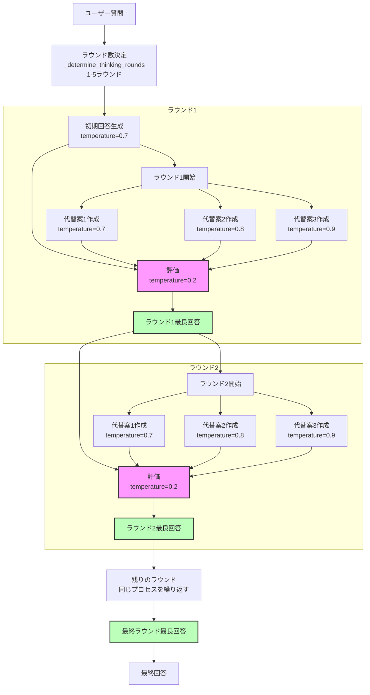

# cort-mcp

Chain-of-Recursive-Thoughts (CORT) MCPサーバー/CLIツール

---

## 特徴
- OpenAI/OpenRouter API両対応
- pipx/uvxインストール・即コマンド利用可能
---

## ディレクトリ構成

```
cort-mcp/
├── cort_mcp/
│   ├── __init__.py
│   ├── recursive_thinking_ai.py
│   └── server.py
├── pyproject.toml
├── README.md
├── CHANGELOG.md
└── tests/
    └── test_server.py
```

---

## インストール

```
pipx install .
# または
uvx install .
```

---

## ツールインターフェイス定義（MCPツール仕様）

---

## Mixed LLM 拡張（多様モデル探索モード）

**概要:**
従来のCoRT思考フローに「代替案ごとに異なるLLM（モデル＋プロバイダ）をランダム選択する」探索戦略を追加した新ツールです。
これにより、異種モデルの知見や発想を最大限活用し、より多様な案から最適解を選抜できます。

### mixed LLMツール一覧
- `cort_think_simple_mixed_llm`
  履歴や詳細を出力しないシンプルな再帰的思考AI応答（各案ごとにLLMをランダム選択）
- `cort_think_details_mixed_llm`
  思考過程や履歴付きの応答（各案ごとにLLMをランダム選択、履歴にも使用モデルを記録）

### mixed LLMで利用されるモデル一覧
- **OpenAI**
    - gpt-4.1-mini
    - gpt-4.1-nano
    - gpt-4o
    - o3-mini
- **OpenRouter**
    - meta-llama/llama-4-maverick:free
    - meta-llama/llama-4-scout:free
    - microsoft/phi-4-reasoning:free
    - google/gemini-2.0-flash-exp:free
    - mistralai/mistral-small-3.1-24b-instruct:free
    - nvidia/llama-3.3-nemotron-super-49b-v1:free
※API Keyが有効なプロバイダのみ対象となります。

### mixed LLMツールの動作仕様
- 各代替案ごとに、上記リストからランダムで1つLLM（モデル＋プロバイダ）を選択
- 生成案ごとに「どのモデル・プロバイダが使われたか」を必ずログに記録
- detailsモードでは、レスポンスの履歴情報にも「案ごとの使用モデル・プロバイダ」を明示的に含める

### レスポンス例
```json
{
  "alternatives": [
    {
      "response": "案1の内容...",
      "provider": "openai",
      "model": "gpt-4.1-mini"
    },
    {
      "response": "案2の内容...",
      "provider": "openrouter",
      "model": "meta-llama/llama-4-maverick:free"
    }
  ],
  "best": {
    "response": "ベスト案の内容...",
    "provider": "openai",
    "model": "gpt-4o"
  },
  "details": "履歴や評価過程（YAML/JSON形式で案ごとのモデル名も記録）"
}
```

### ログ出力例
```
[INFO] Alternative 1: provider=openai, model=gpt-4.1-mini
[INFO] Alternative 2: provider=openrouter, model=meta-llama/llama-4-maverick:free
```

### 注意事項
- 既存の `cort_think_simple` / `cort_think_details` とは独立した新ツールとして提供
- APIコスト・レイテンシにご注意ください（複数プロバイダ/モデルを横断的に呼び出します）
- モデルごとの仕様差やAPI制限により、出力形式や品質が異なる場合があります

---


> **⚠️ 注意:**
> オプションパラメータ（`model`や`provider`など）をAI呼び出し時に明示的に`null`や空文字で渡すと、API側でエラーとなる場合があります。
> 
> **未指定の場合はパラメータごと省略してください。**
> 例: Pythonの`None`やJSONの`null`をそのまま渡さず、パラメータ自体を送信しないことを推奨します。
> 
> これにより「AI呼び出し時にオプションパラメータへnullを設定し失敗していた問題」を回避できます。


### cort.think.simple
- **説明:** 履歴や詳細を出力しないシンプルな再帰的思考AI応答を返す
- **パラメータ:**
    - `prompt` (string, 必須): AIへの入力プロンプト
    - `model` (string, 任意): 
利用するLLMモデル名を正確に指定してください。
- **推奨値（OpenAIの場合）**: `"gpt-4.1-nano"`
- **推奨値（OpenRouterの場合）**: `"meta-llama/llama-4-maverick:free"`
- **デフォルトモデル**: `mistralai/mistral-small-3.1-24b-instruct:free`（OpenRouterプロバイダ使用時）
モデル名は各プロバイダの公式リストに従い、正確に入力してください。
指定がない場合はプロバイダごとのデフォルトモデルが利用されます。

    - `provider` (string, 任意): 
利用するAPIプロバイダ名を正確に指定してください。
- 指定可能値: `"openai"` または `"openrouter"`
- **デフォルトプロバイダ**: `openrouter`
プロバイダによって選択可能なモデルが異なるため、モデル名とプロバイダの組み合わせにご注意ください。指定がない場合、自動的にデフォルトプロバイダが利用されます。

    - **戻り値:**
    - `response` (string): AIの応答
    - `model` (string): 使用モデル名
    - `provider` (string): 使用プロバイダー

### cort.think.details
- **説明:** 思考過程の詳細も含めて返す再帰的思考AIツール
- **パラメータ:**
    - `prompt` (string, 必須): AIへの入力プロンプト
    - `model` (string, 任意): モデル名
    - `provider` (string, 任意): "openai" または "openrouter"
- **戻り値:**
    - `response` (string): AIの応答
    - `model` (string): 使用モデル名
    - `provider` (string): 使用プロバイダー
    - `details` (string): 思考履歴や過程のYAML

#### パラメータ指定とフォールバック処理

本APIでは、`provider` と `model` パラメータの指定に応じて、以下のロジックで実際の使用モデルが決定され、エラー時にはフォールバック処理が行われます。

1.  **プロバイダ (`provider`) の解決**
    *   **未指定時**: デフォルトプロバイダとして `openrouter` が使用されます。
    *   **不正な値指定時** (`openai`, `openrouter` 以外): デフォルトプロバイダ `openrouter` にフォールバックします。

2.  **モデル (`model`) の解決**
    *   **未指定時**:
        *   解決されたプロバイダが `openrouter` の場合: デフォルトモデル `mistralai/mistral-small-3.1-24b-instruct:free` が使用されます。
        *   解決されたプロバイダが `openai` の場合: OpenAIのデフォルトモデル（例: `gpt-3.5-turbo`、サーバー側の定義に依存）が使用されます。
    *   **指定時（プロバイダは有効）**:
        *   指定されたモデル名が、解決されたプロバイダでそのまま使用されます。
        *   **重要**: この段階では、指定されたモデル名がプロバイダに実際に存在するかどうかの検証は行われません。

3.  **API呼び出しとエラー時のフォールバック**
    *   上記ルールで解決されたプロバイダとモデルの組み合わせで、まずAPI呼び出しが試行されます。
    *   **API呼び出し時にエラーが発生した場合**（例: 指定したモデルがプロバイダに存在しない、APIキー認証エラーなど）:
        *   **条件1**: エラーが発生した最初の試行のプロバイダが `openai` では**ない**こと。
        *   **条件2**: 環境変数 `OPENAI_API_KEY` がシステムに設定されていること。
        *   上記の2つの条件を**両方とも満たす場合**、システムは自動的に **`openai` プロバイダのデフォルトモデル** を使用して処理を再試行します（これがフォールバック処理です）。
        *   上記条件のいずれか、または両方を満たさない場合（例: 最初の試行が `openai` だった、または `OPENAI_API_KEY` が未設定）、最初のエラーがそのまま最終結果として返され、この種のフォールバックは行われません。

**環境変数に関する注意:**
*   `openrouter` を利用する場合、`OPENROUTER_API_KEY` が必要です。
*   `openai` を利用する場合、または上記フォールバック機能を利用する可能性がある場合は `OPENAI_API_KEY` が必要です。
*   該当するAPIキーが設定されていない場合、API呼び出しは失敗します（フォールバック条件によってはOpenAIへのフォールバックも失敗します）。

---

## APIキー設定
- OpenAI: `OPENAI_API_KEY` 環境変数で指定
- OpenRouter: `OPENROUTER_API_KEY` 環境変数で指定

---

## 進捗・現状レポート（2025-05-08 更新）
### ✅ MCPサーバー起動・MCP Hostからの呼び出し成功
- それほど長くない入力の応答に約1~2分程度かかる
### ✅ logging機能の動作確認
- 引数によるlog=on/offの動作確認
- 引数による指定PATHへlogfile保存確認
### ✅ 思考ラウンドの詳細出力確認
- cort_think_detailsのdetails出力のYAML形式の内容確認
- 各ラウンドのLLMからの出力内容を出力
### ✅ OpenAI/OpenRouter両対応のAPI呼び出し
- デフォルトは「openrouter / mistralai/mistral-small-3.1-24b-instruct:free」です
- OpenAIはAPIキーが無い場合の自動フォールバック先として利用されます
- 動作確認済み

#### 📝 ユーザー追加分TODO
- .log 出力の詳細化
- 評価プロンプトの見直し
- README刷新 (内容の精緻化、オリジナルリポジトリに関する言及、英語化)
- コードコメントの英語化
- pipx起動対応
- PyPI公開
---

## コアロジック改変履歴（recursive_thinking_ai.py）

- オリジナル: [PhialsBasement/Chain-of-Recursive-Thoughts](https://github.com/PhialsBasement/Chain-of-Recursive-Thoughts)
- 本プロジェクトでは以下の主な改変を実施：

### 主な改良点

1. **プロバイダ対応の拡張**
   - デフォルトは「openrouter / mistralai/mistral-small-3.1-24b-instruct:free」
   - OpenAIはAPIキーが無い場合の自動フォールバック先
   - OpenRouterのみの対応から、OpenAIとOpenRouter両対応のAPI呼び出しに変更
   - `provider`引数で簡単に切り替え可能

2. **詳細な思考履歴の記録**
   - 各ラウンドでのLLMプロンプト・レスポンス履歴（thinking_history）を詳細に記録
   - details toolのレスポンスとして構造化されたYAML形式で返せるように拡張
   - ラウンドごとの選択プロセスが透明化

3. **エラー処理とログ記録の強化**
   - APIエラー時のフォールバックメカニズムを追加
   - 環境変数によるAPIキー管理を追加
   - 外部ログ機能との連携強化

4. **MCPサーバー向け最適化**
   - サーバー連携用のインターフェースに特化
   - CLIインターフェースや対話型機能を削除し、APIとして利用に特化
   - ストリーミング処理を簡略化し、完了後のレスポンス取得に最適化
   - ファイル保存機能を削除し、レスポンス返却に集中


---

### 起動例
```sh
$ cort-mcp
```

### ログ出力例
```
cort-mcp main() started
Server mode: waiting for MCP stdio requests...
Using selector: EpollSelector
Starting stdio_server session...
stdio_server session established. Running server.run...
```

---

## 開発・保守
- AIロジックは `cort_mcp/recursive_thinking_ai.py` に一元化
- CLI/サーバー切替・ツール登録は `cort_mcp/server.py` で管理
- テストは `tests/` 配下

---

## MCP Host Configuration

When running this MCP Server, you **must explicitly specify the log output mode and (if enabled) the absolute log file path via command-line arguments**.

- `--log=off` : Disable all logging (no logs are written)
- `--log=on --logfile=/absolute/path/to/logfile.log` : Enable logging and write logs to the specified absolute file path
- Both arguments are **required** when logging is enabled. The server will exit with an error if either is missing, the path is not absolute, or if invalid values are given.

### Example: Logging Disabled
```json
"CoRT-chain-of-recursive-thinking": {
  "command": "pipx",
  "args": ["run", "cort-mcp", "--log=off"],
  "env": {
    "OPENAI_API_KEY": "{apikey}"
  }
}
```

### Example: Logging Enabled (absolute log file path required)
```json
"CoRT-chain-of-recursive-thinking": {
  "command": "pipx",
  "args": ["run", "cort-mcp", "--log=on", "--logfile=/workspace/logs/cort-mcp.log"],
  "env": {
    "OPENAI_API_KEY": "{apikey}"
  }
}
```

> **Note:**
> - When logging is enabled, logs are written **only** to the specified absolute file path. Relative paths or omission of `--logfile` will cause an error.
> - When logging is disabled, no logs are output.
> - If the required arguments are missing or invalid, the server will not start and will print an error message.
> - The log file must be accessible and writable by the MCP Server process.
> - If you have trouble to run this server, it may be due to caching older version of cort-mcp. Please try to run it with the latest version (set `x.y.z` to the latest version) of cort-mcp by the below setting.

```json
"CoRT-chain-of-recursive-thinking": {
  "command": "pipx",
  "args": ["run", "cort-mcp==x.y.z", "--log=off"],
  "env": {
    "OPENAI_API_KEY": "{apikey}"
  }
}
```

CoRT core logic diagram


## ライセンス
MIT

何か問題や要望があれば、READMEまたはissue等でお知らせください。
